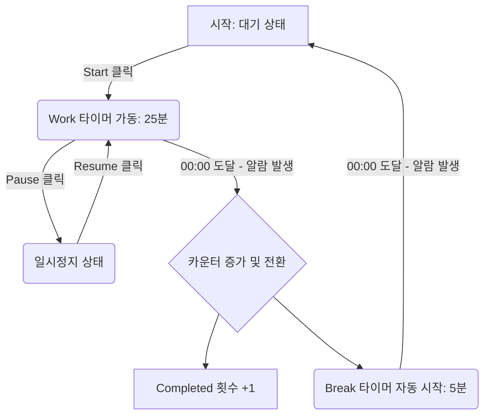
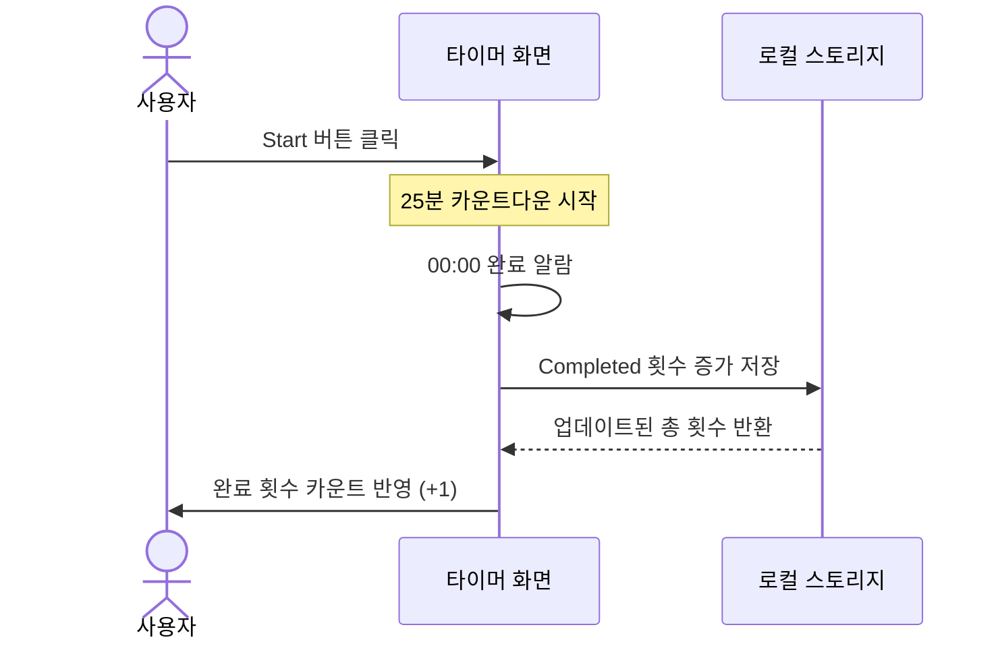

# PRD 형식 예시 (feature-intake 스킬 참조용)

> 이 문서는 `feature-intake` 스킬이 PRD를 작성할 때 **반드시 따라야 할 형식 예시**입니다.
> 아래 "포모도로 타이머" 내용은 예시일 뿐이며, 실제 PRD는 요청받은 기능(이 프로젝트에서는 대부분 Unity 게임 시스템)에 맞게 채웁니다.
> 중요한 건 내용이 아니라 **① 6개 섹션 타이틀 구조(`## 1. What` ~ `## 6. Tech Stack`)**와 **② 다이어그램을 Mermaid로 첨부하는 방식**입니다. 이 둘은 그대로 유지하세요.

---

## 1. What (무엇을 만드는가)
- **한 줄 정의**: 25분 집중, 5분 휴식을 반복할 수 있는 심플한 웹 기반 포모도로 타이머.
- **핵심 시나리오**:
  1. 사용자가 '시작' 버튼을 누르면 25분 카운트다운이 시작된다.
  2. 시간이 다 되면 알림음과 함께 5분 휴식 타이머로 자동 전환된다.
  3. 화면에서 오늘 완료한 뽀모도로 횟수(개수)를 시각적으로 확인할 수 있다.

## 2. Who (누가 쓰는가)
- **타겟 사용자**: 짧은 단위로 집중력을 유지하고 싶은 1인 개발자 및 취준생.

## 3. Behavior (행동 명세: 액션과 반응)
- **Timer Start/Stop**: 'Start' 클릭 시 타이머 작동 및 버튼이 'Pause'로 변경. 'Pause' 클릭 시 일시정지.
- **Mode Switch**: 'Work(25분)'와 'Break(5분)'를 상단 탭으로 수동 전환 가능.
- **Counter**: 작업 완료(00:00 도달) 시 하단 완료 카운트(`Completed: N`)가 1 증가.
- **Alert**: 잔여 시간이 0이 되면 브라우저 기본 알람 소리 재생.

## 4. Errors (예외/에러 처리)
- 타이머가 작동 중일 때 새로고침을 하거나 탭을 닫으려고 하면 경고창을 띄우지 않되, 로컬스토리지(LocalStorage)에 남은 시간을 저장해 복구할 수 있게 한다. (단, MVP 단계에서는 단순 초기화 허용으로 예외 최소화)
- 음수(-) 시간이나 중복 시작 버그가 발생하지 않도록 버튼 상태를 잠금(Disable) 처리한다.

## 5. Out of Scope (이번 버전에서 만들지 않을 것)
- 회원가입 및 로그인 기능 (서버 DB 저장 없음)
- 통계 차트 및 주간/월간 리포트 기능
- 다국어 지원 (한국어 UI만 제공)
- 복잡한 커스텀 시간 설정 (25분/5분 고정)

## 6. Tech Stack (기술 스택)
- **Frontend**: HTML5, Tailwind CSS, Vanilla JavaScript (프레임워크 없음)
- **Storage**: 브라우저 LocalStorage (완료 횟수 저장용)

---

## 다이어그램

behavior(상태/흐름 중심)와 data/action(주체 간 상호작용 중심) 중 기능 성격에 맞는 쪽을 골라 첨부합니다. 필요하면 둘 다 넣어도 됩니다.

### 예시 A: 타이머 상태 전환 흐름도 (Flowchart)

### 예시 B: 데이터 및 액션 흐름도 (Sequence Diagram)

