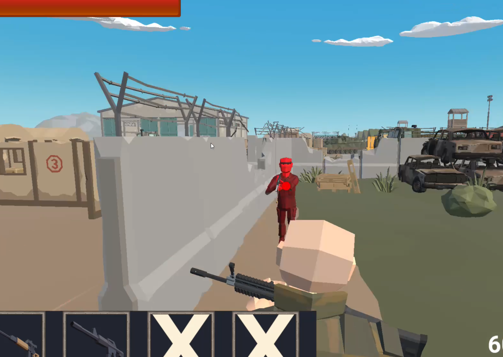
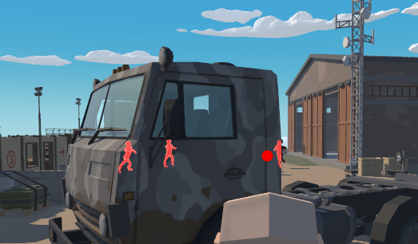

# 라스트 존 (LAST ZONE)

Unity(URP)로 제작 중인 **3인칭/1인칭 전환형 서바이벌 슈팅**입니다.
> 데모 영상: <!-- 영상 링크를 여기에 넣으세요 -->

## 플레이 사진



## 게임 소개

| 항목 | 내용 |
|---|---|
| 장르 | 3인칭/1인칭 전환형 서바이벌 슈팅 |
| 개발 환경 | Unity 2022.3.62f2, URP |
| 플랫폼 | Windows (키보드 + 마우스 전용) |
| 레퍼런스 | 배틀그라운드 |
| 핵심 루프 | 매치 시작 → 루팅 & 이동 → 교전(플레이어 vs AI 봇) → 최후의 1인 |

맵에 떨어진 무기를 주워, 행동 트리 기반 AI 봇과 최후의 1인을 가립니다.

## 조작법

| 입력 | 동작 |
|---|---|
| `W` `A` `S` `D` | 이동 |
| 마우스 이동 | 시점 / 조준 회전 |
| 우클릭 (홀드) | 조준 — 1인칭 전환 (AK는 견착, TRG는 스코프) |
| 좌클릭 | 사격 |
| `V` | 투시 — 벽 너머 적 실루엣 |
| `1` `2` `3` `4` | 인벤토리 슬롯 사용 / 무기 전환 |
| `Space` | 점프 |

## 핵심 시스템 — 시점 전환과 정확도의 교환

| 상태 | 카메라 | 조준 정확도 |
|---|---|---|
| 기본 (3인칭, 미조준) | 3인칭 숄더캠, FOV 60 | 조준 방향에서 무기별 오차각만큼 **매 발 무작위** 편차 |
| 조준 (우클릭 홀드) | 1인칭 전환, 무기별 줌 FOV로 0.12초 보간 | 편차가 크게 감소 |

`CameraZoom`이 FOV 보간과 줌 진행도(0~1)를 계산하고, 그 진행도로 마우스 감도까지 함께 낮춥니다. 스코프 배율이 높을수록 조준선이 덜 흔들리도록 시야각 기반으로 감도를 파생시킵니다.

사격은 히트스캔이 아니라 **투사체 방식**입니다. 발사 요청은 즉시 접수하되 실제 탄 스폰은 `LateUpdate`에서만 수행해, 그 프레임의 최종 조준 방향과 총구 위치가 확정된 뒤에 나가도록 했습니다. 탄속이 유한하므로 거리가 멀수록 리드샷이 필요합니다.

**무기 2종**은 이 메커니즘을 체감시키는 대비 조합입니다.

| 항목 | AK (돌격소총) | TRG (볼트액션 저격총) |
|---|---|---|
| 데미지 | 12 | 100 |
| 발사 간격 | 0.12초 (약 500RPM) | 1.0초 |
| 탄속 | 60 | 300 |
| 조준 모드 | 견착 (FOV 20) | 스코프 (FOV 12, 조준 시 무기 숨김) |
| 반동 | 0.5 | 5 |
| 성격 | 빠르지만 부정확할 수 있음 | 느리지만 맞으면 확정적 |

무기 스탯은 전부 `SOAttackInfo` ScriptableObject로 분리되어 있어 코드 수정 없이 밸런스를 조정할 수 있습니다.

## 몬스터 AI — Behavior Tree

- **구조** — Sequence / Select 컴포지트 + ScriptableObject Action 노드 + Blackboard. 약 **28종의 BT 노드**가 구현되어 있으며, 인스펙터에서 조립·교체할 수 있습니다.
- **행동** — 지각(시야각 · 거리 · 레이) → 순찰(체크포인트 순회) → 추적 → 조준 · 사격 → 저HP 시 은신/도주까지 단계별로 분기합니다.
- **데이터 오염 방지** — SO는 데이터만 갖고, 런타임 상태는 Blackboard 또는 몬스터별로 클론되는 컴포지트 노드에만 둡니다. 원본 SO 에셋은 여러 몬스터가 공유하므로 상태를 갖는 순간 즉시 오염됩니다.

## 핵심 기술

- **URP Renderer Feature 기반 투시(X-Ray)** — `EnemyXRayFeature`가 Opaque가 다 그려진 뒤 Enemy 레이어만 2패스로 덧그려, 깊이 테스트에서 밀린(= 벽에 가려진) 적만 실루엣으로 비칩니다. 머티리얼 에셋을 따로 만들지 않고 셰이더 참조로 런타임 머티리얼을 생성합니다
- **Animation Rigging 기반 조준 포즈** — Two Bone IK로 왼손을 무기 그립에 붙이고, Multi-Aim Constraint로 상체가 조준점을 따라가게 해 상하체 애니메이션 레이어 분리 없이 처리합니다.
- **플레이어 히트맵** — 플레이어 위치를 **별도 스레드**에서 그리드 가중치로 누적하고 주기적으로 CSV로 저장합니다. 레벨 디자인 검증용 동선 분석 데이터로 사용합니다.
- **오브젝트 풀링** — `SOPoolData` + `PoolObject` + `ObjectPoolManager` 구조. Addressables 프리워밍, PriorityQueue 기반 자동 반납, Generation 가드로 Instantiate/Destroy 오버헤드를 제거합니다.
- **UniTask 비동기** — 코루틴을 쓰지 않습니다. 모든 비동기는 `CancellationToken`과 함께 UniTask로 처리합니다.
- **C# 이벤트 기반 시스템 간 통신** — DI 컨테이너 없이 `event Action<T>`로 느슨하게 결합합니다.

## 프로젝트 구조

```
Assets/
├─ 01 Manager/     게임/씬/카메라/입력/오브젝트풀 매니저, 히트맵
├─ 02 Player/      플레이어 이동, 무기, 조준, 수류탄, 투시
├─ 03 Data/        ScriptableObject 데이터 (무기 스탯, 장비, 풀, 씬)
├─ 04 Bullet/      투사체 프리팹 · 리소스
├─ 05 Enemy/       몬스터 AI (Behavior Tree, SO 노드 28종)
├─ 06 UI/          인벤토리, 스코프 오버레이, 버튼 UI
├─ 07 Rendering/   URP Renderer Feature, 투시 셰이더
├─ 99 Utility/     PriorityQueue 등 공용 자료구조
├─ Scenes/         StartScene, BattleScene
└─ Plugins/        UniTask 등 서드파티
```

## 진행 상황

| 시스템 | 상태 |
|---|---|
| 3인칭 ↔ 1인칭 전환, 줌 연동 감도 | 구현 완료 |
| 투사체 사격, 오차각, 반동 | 구현 완료 |
| 무기 2종(AK / TRG), 픽업, 무기 전환 | 구현 완료 |
| Behavior Tree 몬스터 AI (노드 28종) | 구현 완료 |
| 수류탄 투척 + 포물선 예고선 | 구현 완료 |
| 투시(X-Ray) 능력 | 구현 완료 |
| 오브젝트 풀링, Addressables 씬 로딩 | 구현 완료 |
| 플레이어 히트맵 기록 | 구현 완료 |
| 탄창 / 예비탄 / 재장전 | 예정 |
| 헤드샷 판정 | 예정 |
| 소비 아이템(붕대 · 구급상자 · 방탄조끼) | 예정 |
| 자기장(Zone) 축소 시스템 | 예정 |
| 승패 판정 및 결과 화면 | 예정 |

## 스크린샷

### 3인칭 (기본 시점)


### 1인칭 조준 — AK 견착


### 1인칭 조준 — TRG 스코프


### 투시 (X-Ray)




